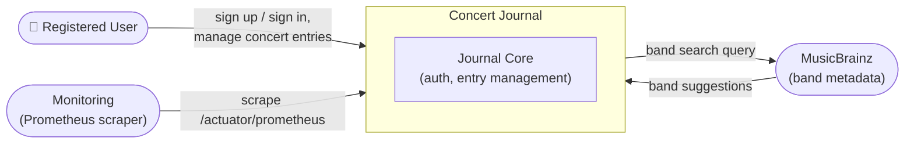
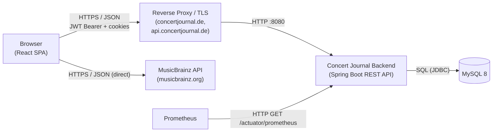

# 3. Context and Scope

<!-- https://docs.arc42.org/section-3/ -->

<!-- arc42 tip: Draw a clear boundary around your system.
     Show every external actor (users, systems, services) that communicates with it.
     Business context focuses on WHAT is exchanged (domain language);
     technical context adds HOW (channels, protocols, formats). -->

## 3.1 Business Context

<!-- tip: Show the system as a black box. All external communication partners appear outside the box.
     Emphasise data flows and domain language — avoid protocol details here.
     A context diagram combined with a table is the recommended form.
     Aggregate similar external systems to keep the diagram readable. -->

| Partner | Input to System | Output from System |
|---|---|---|
| Registered User | Credentials, concert entries (band, place, date, rating, comment) | Journal data, authentication (tokens), entry confirmations |
| MusicBrainz | Band search results (name, disambiguation) | Search term from the entry form |
| Monitoring / Prometheus | Metrics scrape requests | JVM/application metrics |

> Note: the MusicBrainz lookup is called **directly from the browser** (`frontend/src/api/musicBrainzApi.tsx`), not proxied through the backend. The backend has no outbound integration at all.

## 3.2 Technical Context

<!-- tip: Map each business-level interface to its technical channel and protocol.
     Include infrastructure elements (API gateways, message queues, CDNs) that sit
     between your system and its partners.
     A deployment-style diagram or UML component diagram works well here. -->

| Channel | Protocol | Direction | Notes |
|---|---|---|---|
| Browser → Backend | HTTPS REST / JSON via reverse proxy | Inbound | Auth via `Authorization: Bearer <access token>` + `refreshToken` cookie; CSRF via `X-XSRF-TOKEN` header/cookie double submit |
| Backend → MySQL | JDBC (`mysql-connector-j`) | Outbound | `jdbc:mysql://mysql:3306/concertjournal`; H2 file DB in default profile |
| Browser → MusicBrainz | HTTPS JSON API | Outbound (browser-side) | Band lookup during entry creation; not proxied by backend |
| Prometheus → Backend | HTTP `GET /actuator/prometheus` | Inbound | Spring Boot Actuator + Micrometer; permitted anonymously in the security config |

### System scope / boundary

**In scope:** user registration & authentication, concert entry CRUD, per-user data isolation, SPA hosting in production mode, test-data seeding, rate limiting, security headers.

**Out of scope:** social features, concert discovery/import from external calendars, admin back office, mobile apps, server-side band metadata integration, email/password reset.
