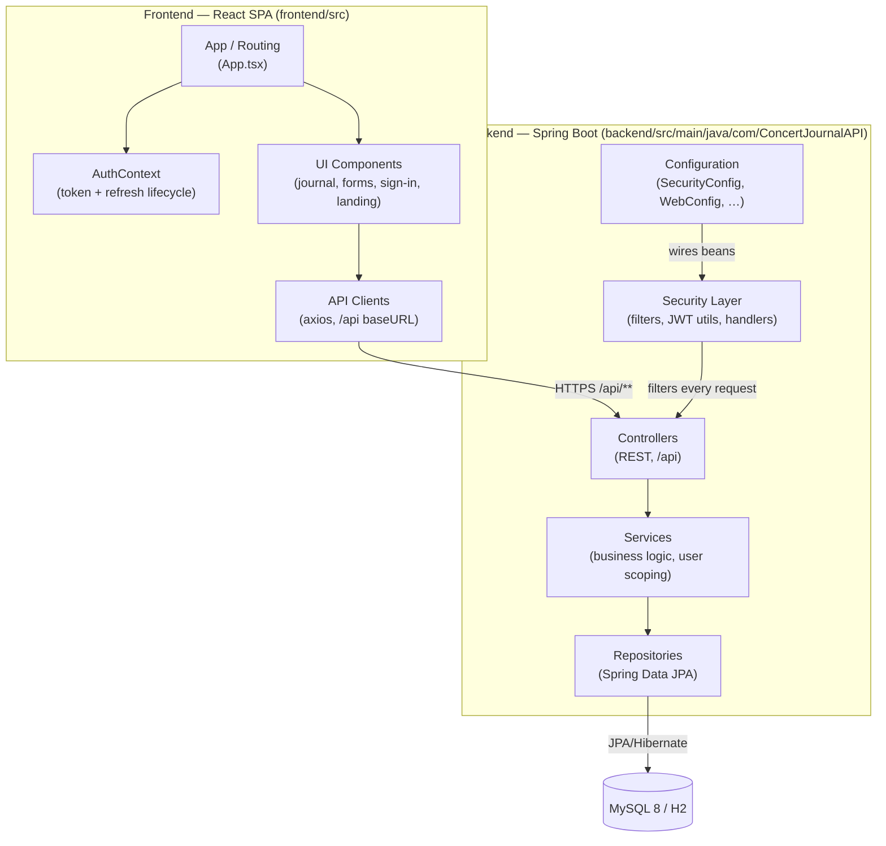
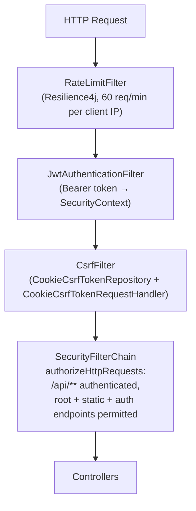

# 5. Building Block View

<!-- https://docs.arc42.org/section-5/ -->

<!-- arc42 tip: This is the "floor plan" of the architecture — the most-read section.
     Always document Level 1. Refine to Level 2 / Level 3 only for building blocks that are
     complex, risky, or frequently changed.
     Each box must have a stated responsibility and a source-code mapping. -->

## Level 1 — Overall System

<!-- tip: Show your system as a white box containing its top-level components (modules, packages, services).
     External systems from section 3 appear here as black boxes at the boundary.
     Every component in this diagram must be described in the table below.
     Use the same names as your source-code folders / packages. -->

### Contained Building Blocks

<!-- tip: One row per top-level component. "Source path" should match actual directories/packages. -->

| Block | Responsibility | Source path |
|---|---|---|
| Frontend: App & Routing | Class-component shell; lazy-loaded routes (`/`, `/new-entry`, `/your-journal`, `/statistics`, `/edit-entry/:id`, `/sign-in`, `/sign-up`) behind `AuthenticatedPage` guard | `frontend/src/App.tsx`, `frontend/src/index.tsx` |
| Frontend: AuthContext | Owns access token, CSRF token, silent refresh interval (2 min), login state | `frontend/src/contexts/AuthContext.tsx` |
| Frontend: API Clients | Axios instance (`baseURL: /api`, `withCredentials`), auth/event calls, error normalisation, MusicBrainz lookup | `frontend/src/api/*.tsx` |
| Frontend: UI Components | Journal table, entry forms, sign-in/up pages, landing page, statistics dashboard (MUI X Charts), navbar, theming | `frontend/src/components/**` |
| Backend: Controllers | REST endpoints (`BandEventController`, `HomeController`, `SecurityController`, `UserController`), SPA forwarding (`SpaController`), login page (`LoginController`) | `backend/.../controller/` |
| Backend: Services | `BandEventService` (CRUD + per-user ownership scoping), `CustomUserDetailsService` | `backend/.../service/` |
| Backend: Repositories | `BandEventRepository`, `AppUserRepository` (Spring Data JPA) | `backend/.../repository/` |
| Backend: Security Layer | `JwtAuthenticationFilter`, `JwtUtils`, auth success/failure handlers, `RateLimitFilter` | `backend/.../security/`, `backend/.../filter/` |
| Backend: Configuration | `SecurityConfiguration` (filter chain, headers, CSRF), `PasswordConfig` (BCrypt), `WebConfig`, `MetricsConfig`, `SecurityConstants` | `backend/.../configuration/` |
| Backend: Data & Startup | `DataLoader` (seeds 10 dummy events when DB is empty), Flyway migrations | `backend/.../DataLoader.java`, `backend/src/main/resources/db/migration/` |

---

## Level 2 — Security / Request Processing

<!-- tip: Create a Level 2 section only when a Level-1 block is complex enough to need its own diagram.
     Use the same white-box / black-box pattern as Level 1.
     Delete this section if your domain layer is simple. -->

| Block | Responsibility | Source path |
|---|---|---|
| `RateLimitFilter` | 60 requests/minute per client (X-Forwarded-For → X-Real-IP → remote addr); returns 429 on exhaustion | `backend/.../filter/RateLimitFilter.java` |
| `JwtAuthenticationFilter` | Extracts `Authorization: Bearer` token, parses claims, sets `UsernamePasswordAuthenticationToken` (subject = email, no authorities) | `backend/.../security/JwtAuthenticationFilter.java` |
| `JwtUtils` | Static token factory/signature (HMAC via `JWT_SECRET` env var); access token 3 min, refresh token 30 days | `backend/.../security/JwtUtils.java` |
| `AuthSuccessHandler` | On formLogin success: returns access + refresh token JSON body, sets `refreshToken` cookie | `backend/.../security/AuthSuccessHandler.java` |
| `CsrfTokenRepository` | Double-submit cookie (`XSRF-TOKEN`, `SameSite`/`Secure`/`domain` customised) | `backend/.../configuration/SecurityConfiguration.java` |

---

<!-- tip: Add more Level 2 (or Level 3) sections here for other complex building blocks.
     Stop refining when the detail no longer helps readers understand the architecture. -->
