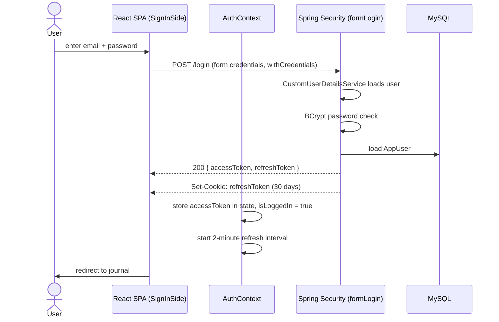
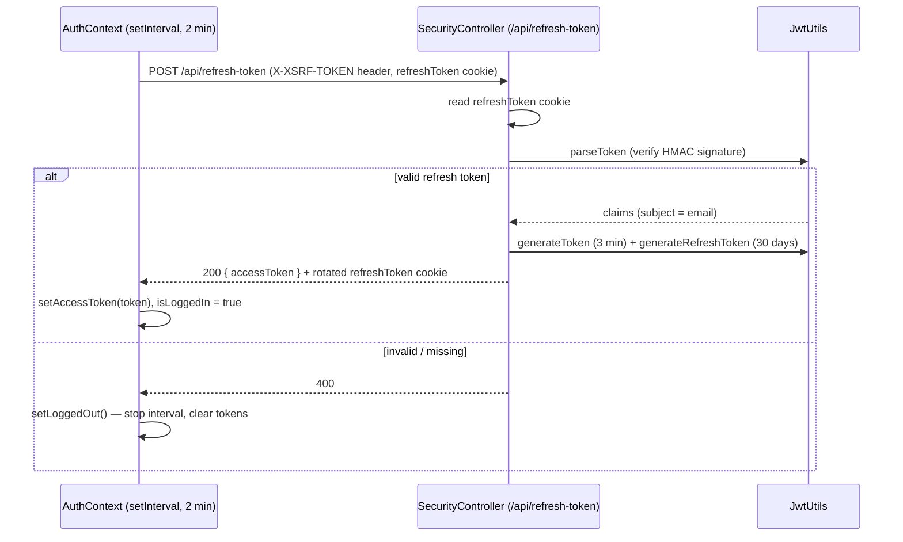
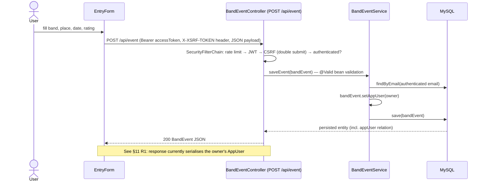
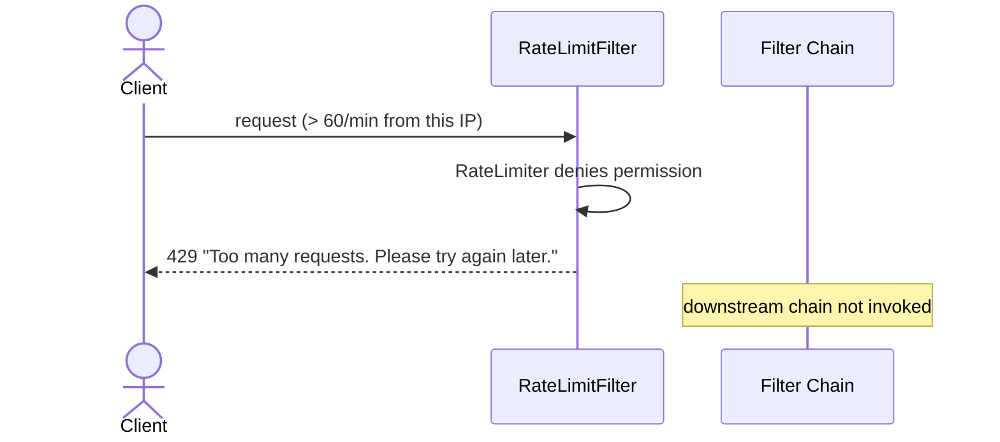
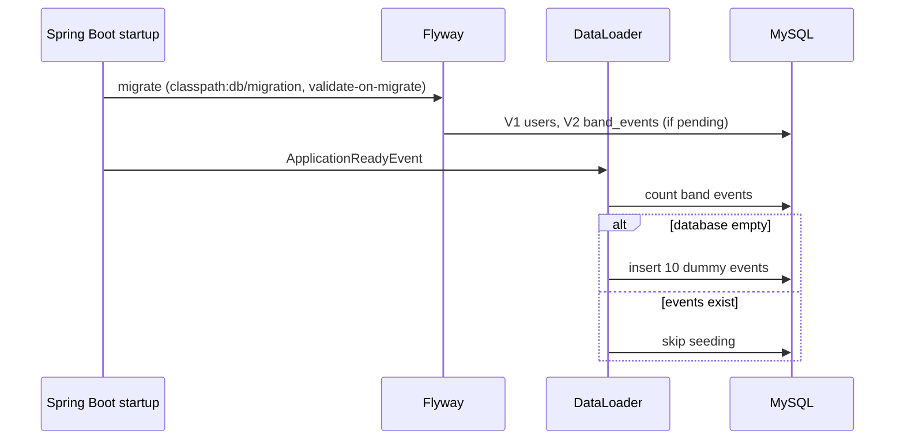

# 6. Runtime View

<!-- https://docs.arc42.org/section-6/ -->

<!-- arc42 tip: Pick 3–5 architecturally significant scenarios — not every flow.
     Focus on: the core happy path, critical failure paths, startup/shutdown, and interactions
     that would surprise a reader who only knows the static structure from section 5.
     Every building block in a diagram here must exist in section 5. -->

## 6.1 Sign In (core happy path)

<!-- tip: Replace this with the single most important runtime flow in your system.
     Use a sequence diagram for request/response patterns.
     Show auth, validation, persistence, and external calls in a single diagram when they all occur. -->

## 6.2 Silent Token Refresh (background flow)

The frontend proactively refreshes the 3-minute access token **every 2 minutes**, on every
app start, and skips refreshing on the sign-in/sign-up pages (`AuthContext.tsx:124-183`).

## 6.3 Create a Journal Entry (CSRF + JWT + ownership)

## 6.4 Error — Rate Limit Exceeded

## 6.5 Startup — Migrations and Test Data

