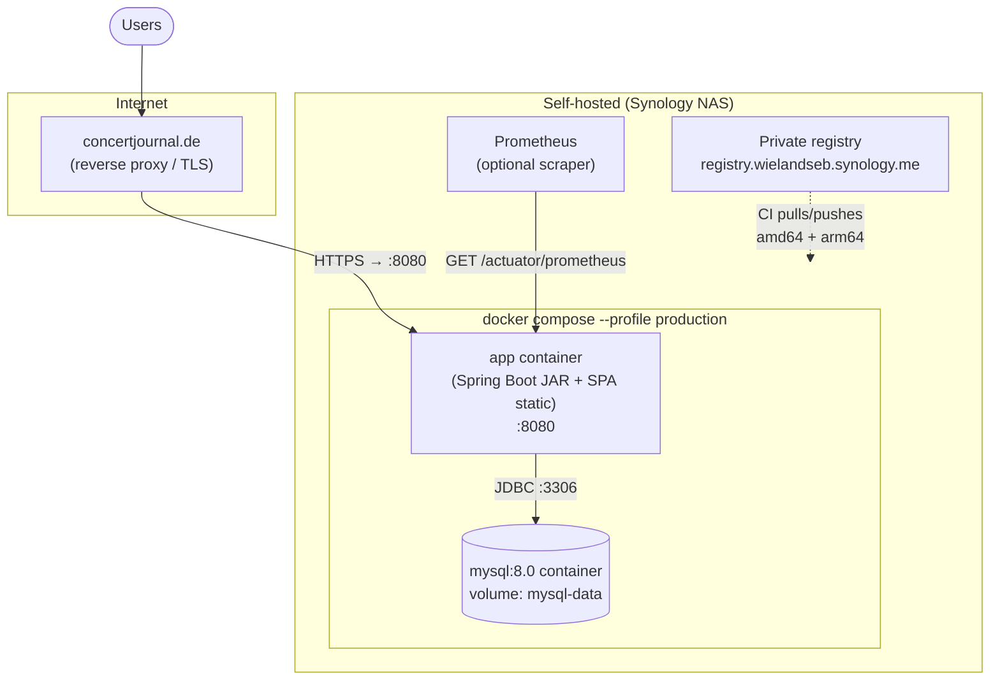
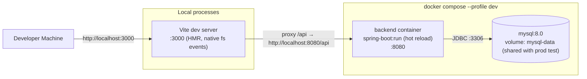
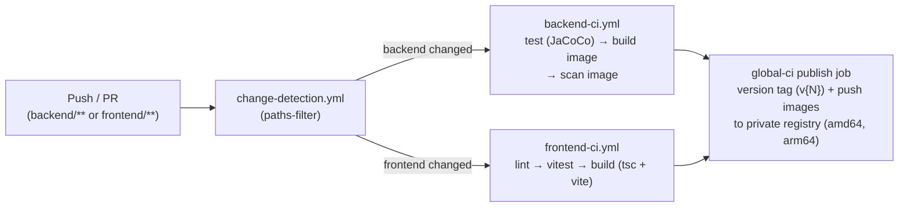

# 7. Deployment View

<!-- https://docs.arc42.org/section-7/ -->

<!-- arc42 tip: Document how software maps to hardware and infrastructure.
     Show all environments that matter architecturally (dev, staging, production).
     Infrastructure choices constrain many crosscutting concerns (scaling, auth, observability) — make them visible.
     Hardware experts should make infrastructure decisions; architects document the consequences. -->

## Infrastructure Level 1 — Production

<!-- tip: Show geographic locations, cloud regions, networks, and major infrastructure nodes.
     Annotate with SLAs, redundancy configuration, and instance/tier sizes where they affect architecture.
     Use swimlanes or nested subgraphs to separate network zones (public, private, data). -->

### Infrastructure Nodes

| Node | Technology | Purpose | Redundancy |
|---|---|---|---|
| Reverse proxy / TLS | Self-hosted (domain `concertjournal.de`, backend also via `api.concertjournal.de`) | TLS termination, routing to app | Single host |
| App | One Docker image: `eclipse-temurin:21-jre-alpine` + `ConcertJournalAPI.jar` + SPA `dist/` at `/app/static/` | Serves SPA and REST API same-origin on :8080 | Single instance; graceful shutdown; container healthcheck via `/actuator/health` |
| Database | `mysql:8.0` container, shared `mysql-data` volume | Persistent storage | None — single node (volume backup is the safety net) |
| Image registry | `registry.wielandseb.synology.me` | Stores multi-arch CI-built images | Self-hosted |

> Uncertainty: the exact production topology (unified same-origin container per `docker-compose.yml`
> profile `production` vs. split frontend/backend via `api.concertjournal.de`) is ambiguous in the
> repo — cookie code supports both (`SameSite=None` + `Domain=concertjournal.de` for split mode;
> `app.static.location` for unified mode). CI publishes to the private Synology registry.

## Infrastructure Level 2 — Development / Local

<!-- tip: Document the local dev setup if it differs from production.
     Call out intentional simplifications (single-node DB, no cache, no CDN).
     This helps developers understand what they are NOT testing locally. -->

Started via `./local-dev.sh`. Differences that could mask production bugs:

- No TLS and no reverse proxy locally — `Secure`/`SameSite` cookie behaviour is **not** testable in hybrid mode (dev profile explicitly uses `SameSite=None` + forced `Secure`, but on `http://localhost`).
- Full-Docker mode uses filesystem **polling** for HMR instead of native events — slower, but closer to prod file layout.
- Dev backend runs from mounted source (`./backend:/app`) with `spring-boot:run`, not the packaged JAR.

## CI/CD Pipeline

Images are built from the root multi-stage `Dockerfile` (frontend build → backend build → production stage) with BuildKit caching against the private registry.
