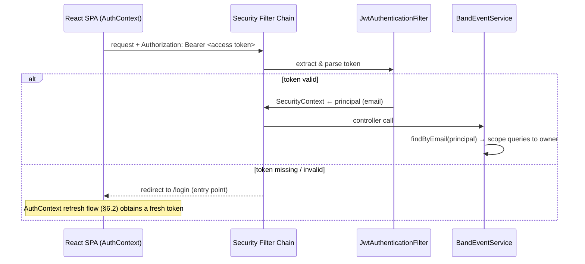
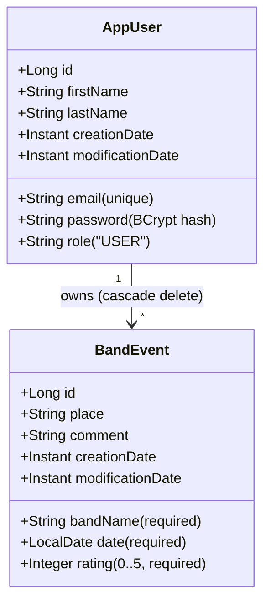

# 8. Crosscutting Concepts

<!-- https://docs.arc42.org/section-8/ -->

<!-- arc42 tip: Crosscutting concepts are practices and patterns that apply to multiple building blocks.
     They create conceptual integrity — the system feels coherent because the same rules apply everywhere.
     Only document the non-obvious and project-specific ones.
     Generic "always use HTTPS" or "write tests" are not worth documenting here. -->

## Authentication and Authorisation

<!-- tip: Document the auth mechanism, token format, expiry, refresh strategy,
     and how building blocks enforce it (middleware, guards, annotations).
     Distinguish between authentication (who are you?) and authorisation (what can you do?). -->

Authentication is **JWT-based** (HMAC-SHA, symmetric key from `JWT_SECRET` env var):
formLogin issues a 3-minute **access token** (returned as JSON, held in React state) and a
30-day **refresh token** (also mirrored in a cookie). A servlet filter validates the Bearer
token on every request and populates the `SecurityContext` with the email as principal (no
authorities). The SPA silently refreshes the access token every 2 minutes via
`POST /api/refresh-token`, which also rotates the refresh cookie.

Authorisation is **path-based** (`/api/**` requires authentication) plus **ownership-based**:
every `BandEventService` method re-resolves the `AppUser` by the authenticated email and scopes
repository queries to that user (`findAllByAppUser`, `findByIdAndAppUser`, `deleteByIdAndAppUser`).
`HomeController./api/me` additionally uses `@PreAuthorize("isAuthenticated()")`.

Known weaknesses (see §11 R2): access and refresh tokens share the same signing key and claim
shape — a refresh token is accepted as an access token; there is no revocation list.

## CSRF Protection

Double-submit cookie pattern: `CookieCsrfTokenRepository` issues a readable `XSRF-TOKEN` cookie
(`httpOnly=false` so the SPA can copy it), and `CookieCsrfTokenRequestHandler` validates the
`X-XSRF-TOKEN` header against the cookie on every non-idempotent request. Only GET/HEAD/OPTIONS/
TRACE are exempt (Spring default; the `csrfRequestMatcher` bean in `SecurityConfiguration.java:88`
encoding the same exemption is **not wired into the CSRF config** — dead code, see §11 TD1).
`SameSite=None` + `Secure` are forced because the SPA may
sit on a sibling subdomain (`concertjournal.de` / `api.concertjournal.de`); the cookie `Domain`
is currently hardcoded to `concertjournal.de` (see §11 TD5).

## Security Headers

Set centrally in `SecurityConfiguration`: CSP, HSTS, X-Frame-Options (SAMEORIGIN),
Referrer-Policy, Permissions-Policy. OWASP-motivated, but note that the `@Value`-injected
configuration fields for these headers are **not wired** into the filter chain — the values are
hardcoded there (see §11 TD1). The CSP still contains `unsafe-inline`/`unsafe-eval` for script-src.

## Rate Limiting

`RateLimitFilter` (Resilience4j `RateLimiter`, 60 requests/minute) applies to **every** request,
keyed by client IP (`X-Forwarded-For` → `X-Real-IP` → `remoteAddr`, spoofable if the proxy does
not sanitize). Exceeding requests get a 429 and never reach the security chain.

## Observability — Logging, Metrics

- **Metrics:** Spring Boot Actuator + Micrometer Prometheus registry; `/actuator/prometheus` is
  permit-all in the security config. Dev exposes all actuator endpoints; prod limits to
  `health,info,metrics,prometheus`.
- **Logging:** plain SLF4J text logs to stdout. Dev profile enables DEBUG for web/security plus
  `log-request-details`; the frontend has extensive `console.log` guarded by `NODE_ENV`.
- No tracing, no log aggregation.

## Error Handling Strategy

<!-- tip: Distinguish expected errors (domain violations, validation) from unexpected ones (infrastructure failures).
     Document how each propagates to the HTTP response and whether it is logged.
     Consistency here prevents half the "why did this return a 500?" debugging sessions. -->

| Error type | Propagation | HTTP status | Logged |
|---|---|---|---|
| Bean validation failure (`@Valid`) | Spring MVC method validation | 400 | No |
| Not authenticated | `LoginUrlAuthenticationEntryPoint` | 302 → `/login` | No |
| CSRF token mismatch | Spring Security CsrfFilter | 403 | No |
| Rate limit exceeded | `RateLimitFilter` writes body directly | 429 | No |
| Unauthenticated service call / event not found | `BandEventService` throws `RuntimeException` | 500 | Container logs |
| Event lookup miss | `getEventById` returns `null` | 200 empty body | No |
| Invalid refresh token | `SecurityController` catches `JwtException` | 400 | No |

There is **no** `@ControllerAdvice`/global exception handler on the backend; expected domain
errors surface as 500s (see §11 TD2). The frontend normalises axios errors centrally in
`apiErrors.ts`.

## Domain Model

<!-- tip: A diagram of core domain entities and relationships anchors the glossary (§12) and helps every reader.
     Keep it at the entity/aggregate level — not at the DB schema level.
     Update it when the domain changes, not just when the schema changes.
     Coordinate term naming with section 12. -->

Two entities only, mirrored by Flyway migrations `V1__create_users_table.sql` and
`V2__create_band_events_table.sql` (1:N, `ON DELETE CASCADE`). Auditing timestamps are
maintained by Hibernate `@CreationTimestamp`/`@UpdateTimestamp`.

## Persistence and Profiles

Spring Data JPA with `ddl-auto=validate` (Flyway owns the schema). Three profiles:
**default** (H2 file DB, e.g. plain IDE run), **dev** (`jdbc:mysql://localhost:3306`, swagger on,
insecure cookie settings), **production** (env-driven MySQL URL/credentials, swagger off,
`app.static.location=file:/app/static/`). Test data seeding via `DataLoader` runs in all
profiles whenever the `band_events` table is empty.
