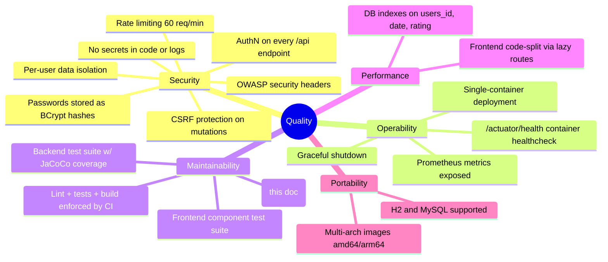

# 10. Quality Requirements

<!-- https://docs.arc42.org/section-10/ -->

<!-- arc42 tip: This section makes the quality goals from section 1.2 measurable and testable.
     A quality scenario has: a stimulus, a context, and a measurable response.
     Distinguish usage scenarios (normal operation) from change scenarios (modification effort).
     Use this section as an input for architecture reviews (e.g. ATAM). -->

## 10.1 Quality Tree

<!-- tip: A quality tree organises all quality attributes hierarchically.
     Use it as a checklist during design and review.
     The top-level nodes come from the quality goals in section 1.2.
     Add leaf nodes as concrete, measurable requirements. -->

## 10.2 Quality Scenarios

### Usage Scenarios

<!-- tip: Usage scenarios describe how the system behaves at runtime in response to a stimulus.
     "System" is the artifact. "Response measure" must be objective and testable.
     Use short form for table entries; add a sub-section for complex scenarios. -->

| ID | Quality | Stimulus | Context | Response | Measure |
|---|---|---|---|---|---|
| QS-U1 | Security | Unauthenticated request hits `/api/allEvents` | Any time | 302 to `/login` | 0 event rows in response |
| QS-U2 | Security | Authenticated user requests another user's event by id | Normal operation | Ownership scope returns nothing | `getEventById` yields null, no data leak |
| QS-U3 | Security | Script sends > 60 requests/minute from one IP | Internet | Rate limiter rejects | 429 for every request beyond 60/min |
| QS-U4 | Security | Forged request with valid cookie but wrong/missing `X-XSRF-TOKEN` header | Mutating endpoint | CSRF filter rejects | 403 |
| QS-U5 | Operability | Container becomes unhealthy | Production | Docker healthcheck fails | Restart after 3 retries × 30 s interval (`Dockerfile` HEALTHCHECK) |
| QS-U6 | Usability (dev) | Frontend developer edits a component | Hybrid dev mode | HMR update | < 1 s, native fs events (no polling) |
| QS-U7 | Performance | Journal page loads | Typical user (< 100 entries) | Data fetched via react-query | Vite lazy-loaded routes; no bundled monolith chunk |

### Change Scenarios

<!-- tip: Change scenarios capture the effort required to modify the system.
     They directly test the Maintainability and Portability goals.
     "Metric" should be developer-days or story points — something the team can verify. -->

| ID | Quality | Change | Effort | Metric |
|---|---|---|---|---|
| QS-C1 | Maintainability | Add a new REST endpoint | Small | Controller + service + repository + tests, ≤ 1 developer-day |
| QS-C2 | Maintainability | Add a new frontend page | Small | Lazy route + component + `AuthenticatedPage` wrapper; ≤ 1 developer-day |
| QS-C3 | Maintainability | Add a DB column | Small | Flyway `V{N}__*.sql` + entity field; migration runs on next startup |
| QS-C4 | Testability | Set up local dev env from scratch | Small | ≤ 30 min following README / `./local-dev.sh` |
| QS-C5 | Portability | Switch backend-only code | Small | Path-triggered CI rebuilds only backend image |
| QS-C6 | Maintainability | Add a new environment (e.g. staging) | Medium | New Spring profile + compose overrides; watch hardcoded cookie domain (§11 TD5) |
